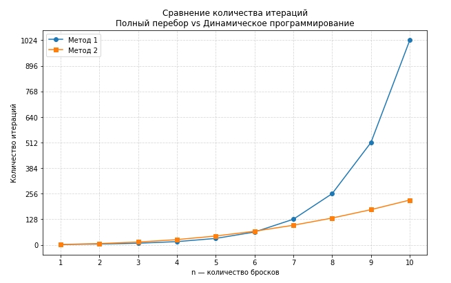

## Задача 
Игрок А и игрок Б играют в игру с подбрасыванием монетки. Будем считать, что монетка честная. 
Правила игры: 
Монетку подбрасывают n раз, и записывают последовательность результатов. "О" - выпал "орел" и "Р" - выпала "решка". 
Игрок А получает 1 балл когда в последовательности на соседних местах стоят "О" и "Р" ("О" слева от "Р"). Количество баллов игрока А обозначим через X. 
Игрок Б получает 1 балл когда в последовательности на соседних местах стоят "О" и "О". Количество баллов игрока А обозначим через Y. 
Если результат X>Y то выигрывает игрок А, если Y>X то выигрывает игрок Б, если X=Y то фиксируется ничья. 
Задание: написать код который расчитывает для n бросков вероятность победы A, вероятность ничьи, вероятность победы Б 

## Решение
Код с решением находится в файле **monetka.ipynb**

Я выполнил эту задачу двумя методами. В первом методе производится перебор всех возможных комбинаций n бросков. На больших значениях n этот метод потребляет очень много ресурсов и времени, поэтому во втором методе я решил отказаться от перебора комбинаций и использую динамическое програмирование. С его помощью я беру уже сохраненные значения последовательности до текущего броска n, а не вычисляю из заново.  

Метод 1
1. Получаю на вход количество бросков n, считаю количество итераций которые понадобятся для расчет возможных комбинаций
2. Запускаю счетчик перебора всех возможных комбинаций, сохраняю их в список
3. Прохожу по этому списку, проверю найденные выигрышные комбинации "ОР" и "ОО", и начисляю баллы игрокам
4. Проверяю баллы и присуждаю выигрыши
5. Вывожу количество итераций и шансы на победу

Метод 2
1. Получаю на вход количество бросков n, считаю количество возможных комбинаций
2. Создаю словарь в котором будут сохранятся все значения бросков до текущего n
3. Запускаю счетчик перебора бросков, сохраняю их в словарь
4. Проверяю баллы и присуждаю выигрыши
5. Вывожу количество итераций и шансы на победу

График показывает количество итераций (затраченных ресурсов) при использовании разных методов

